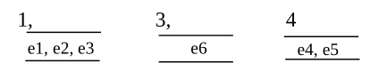
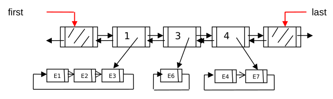
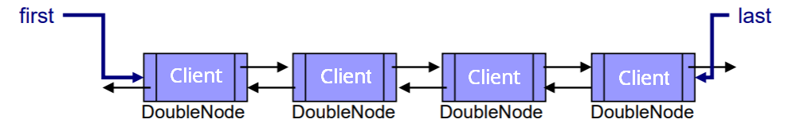
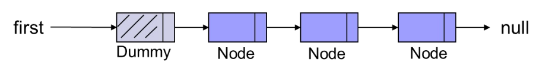
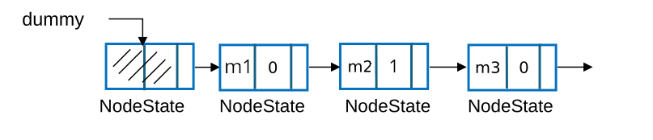
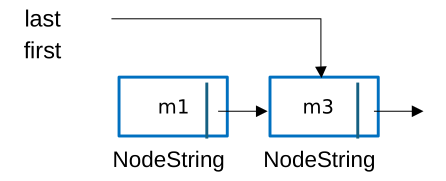
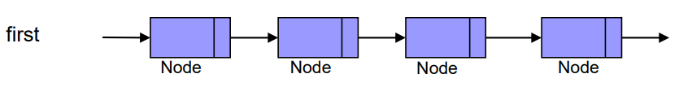

## Ejercicio 1

Existe un TAD denominado `PriorityQueue<T>`, el cual es similar a una cola en la que los elementos tienen, adicionalmente, una prioridad asignada. Por lo tanto, tiene las mismas operaciones que el TAD `Queue<T>` excepto la operación `add`, que ahora recibe dos parámetros: el elemento a insertar  y su prioridad, representada por un entero positivo. Cuanto menor sea el entero, significará que mayor es la prioridad del elemento a insertar.

```java
public interface PriorityQueue<t>{
	public int size();
	public boolean isEmpty();
	public T first() throws EmptyException;
	public T remove() throws EmptyException;
	public void add(T value, int priority) throws NullPointerException, IllegalArgumentException;
}
```

Para su implementación se va a utilizar una lista de prioridades y asociado a cada prioridad una cola de elementos con dicha prioridad. Ten presente que en una cola de prioridad puede haber muchos elementos con la misma prioridad, y los elementos con la misma prioridad se van añadiendo al final de su cola correspondiente. La lista de prioridades está ordenada ascendentemente por prioridad.  
Por ejemplo, si los elementos e1, e2 y e3 se insertaron en este orden y tienen prioridad 1, los elementos e4 y e5 se insertaron en este orden con prioridad 4 y el elemento e6 se insertó  con  prioridad  3, entonces  la  cola  de prioridad  gráficamente  la  podríamos representar:



Observa que no tienen que existir todas las prioridades y que no hay colas vacías. Se pide implementar el TAD `PriorityQueue<T>`, utilizando **estructuras enlazadas**.  Concretamente una estructura doblemente enlazada con nodos centinela al principio y al final y referencias a dichos nodos para representar la lista de prioridades, y una  estructura enlazada simple circular con referencia al último nodo de la estructura para representar la cola de elementos asociada a cada prioridad.

Gráficamente tendríamos algo así:




y se implementaría en la clase `LinkedPriorityQueue<T>`:

```java
public class LinkedPriorityQueue<T> implements PriorityQueue<T> 
{
	private DoubleNode<Value<T>> first;
	private DoubleNode<Value<T>> last;
	private int numberOfValues;
	....
}
```

La información que se guarda en `DoubleNode<T>` será una clase que llamaremos:


```java
public class Value<T> {
	private int priority;
	private Node<T> queue;

	public Value(int priority, Node<T> queue){
		this.priority = priority;
		this.queue = queue;
	}
	public int getPriority(){
		return priority;
	}
	public Node<T> getQueue(){
		return queue;
	}
	public void setQueue(Node<T> queue){
		this.queue = queue;
	}
}	
```

La estructura doblemente enlazada está ordenada ascendentemente por el atributo prioridad y no hay dobles nodos con referencias a colas vacías, es decir, cuando se eliminan todos los elementos de una cola de cierta prioridad, se elimina también la prioridad.

Haciendo uso de las clases `Node<T>` y `DoubleNode<T>` y utilizando las estructuras enlazadas  definidas  anteriormente  (doblemente  enlazada  y  circular),  se  pide implementar únicamente el método  **constructor**,  que crea una cola de prioridad vacía, y el método `remove()` de la clase  `LinkedPriorityQueue<T>`:

```java
public T remove() throws EmptyException
// Modifica: this
// Produce: si no hay elementos en la cola de prioridad, lanza una excepción. En otro caso, devuelve y elimina el elemento de más // prioridad. A igual prioridad, devuelve y elimina el elemento que más tiempo lleva en la cola.

```


## Ejercicio 2

Para trabajar de forma más eficiente en un supermercado se ha diseñado el `TAD Box` que servirá para gestionar las cajas de la empresa. Cada caja de supermercado tiene asignado un número, un saldo y, cuando no está vacía, tiene una **cola de clientes**. Además, cuando un cliente está situado en una `Box` tiene una **lista de productos** para comprar. A su vez, cada producto tiene un código y un precio. Con esta información la interfaz diseñada para dicho TAD `Box` es la siguiente;

```java

public interface Box {
	public int getNumClients();
	// Produce: retorna el número de clientes en la cola de la caja

	public double getBalance();
    // Produce: retorna el saldo de la caja

	public boolean checkOut();
	// Modifica: this
	// Produce: si la caja está vacía retorna falso; en otro caso devuelve cierto y procesa el cliente que más tiempo lleva en la 	  // cola de la Box actualizando el saldo de la Box a partir de los productos que compra

	public void addClient(Client client) throws NullPointerException;
	// Modifica: this
	// Produce: si client es null lanza una excepcion; en otro caso, añade el cliente a la cola de clientes de la caja

	public void removeClient(Client client) throws NullPointerException;
	// Modifica: this
	// Produce: si cliente es null lanza una excepcion; en otro caso, elimina el cliente de la cola 	de la Box (abandona la cola)
}
```

Y la interfaz diseñada para el TAD `Client` es:

```java
public interface Client {

    public boolean hasProducts();
    // Produce: devuelve cierto si el cliente tiene productos; falso en caso contrario

    public void addProduct(Product p);
    // Modifica: this
    // Produce: añade un producto p a la compra del cliente

    public Product removeProduct() throws EmptyPurchaseException;
    // Modifica: this
    // Produce:  si  la  compra  del  cliente  está  vacía  lanza  CompraVaciaExcepcion;  en otro caso, elimina y devuelve un 		// producto de la compra; 
}
```

Para  implementar el TAD `Box`  se  ha  decidido  utilizar  estructuras  enlazadas. Concretamente se ha decidido utilizar una estructura lineal enlazada  simple con referencia al primer y último nodo de la estructura y sin centinela para representar la cola de clientes en la caja ( ver la  clase  `LinkedBox` a  continuación).  Además,  para  guardar los productos que ha comprado cada cliente se ha decidido utilizar una estructura doblemente enlazada  con  referencia  al  primer `DoubleNode`  (ver  la  clase  `LinkedClient`  a continuación). 

```java
public class LinkedBox implements Box {
	private int numBox;
	private double saldo;
	private Nodo<Cliente> primero, ultimo;

	public EnlazadaBox (int numBox, double saldo){
        this.numBox = numBox;
        this.saldo = saldo;
        this.primero = null;
        this.ultimo = null;
    }
    
	// Aquí vendrían los métodos de la interfaz Box
    // ....
}
```

Y donde `Node` guarda una referencia a `Client` que, tal y como se ha dicho, se implementa usando una estructura doblemente enlazada de `Product`, que se muestra a continuación: 

```java
public class LinkedClient implements Client {
	private DobleNode<Product> purchase;	
    
	public LinkedClient(){
		purchase = null;
	}
    
	// Aquí vendrían los métodos de la interfaz Cliente
    // ...
}
```


Gráficamente sería algo así: 





Se pide:

a.  Completar la clase `LinkedClient`, implementando los métodos de la interfaz `Client`, haciendo uso del atributo  compras declarado. La clase  `Product` se define a continuación

```java
public class Product {
    private int code;
    private double price;
    
    public Product(int code, double price)
    public int getCodigo()
    public double getPrecio() 
}

```


b. Completar  la  clase  `LinkedBox`,  En  este  caso  se  pide  implementar **únicamente** el método `checkOut()`.


## Ejercicio 3

Dada una estructura **enlazada de modo simple CON centinela y referencia a dicho nodo**  (`Node first`), se pide implementar el método  `reposition(x,y)`. Dicho método recibe dos enteros `x` e `y` como parámetros y quitará el entero `x` de su posición actual y lo colocará justo a continuación del entero `y`. Se puede suponer que los enteros `x` e `y` están en la estructura y sólo existe una ocurrencia de cada uno de ellos. 





```java
public void reposition(int x, int y) 
//Modifica: this
//Produce: elimina el entero x de su posición y lo coloca a continuacion del entero y. 
```
A continuación se muestra la clase `Node`:

```java
public class Node {
  private int value;
  private Node next;
  public Node(int value, Node next) {…}
  public int getValue() {…}
  public void setValue(int value) {…}
  public Node getNext() {…}
  public void setNext(Node next) {…}
  public boolean hasValue(int value) {…}
}
```


## Ejercicio 4

Se tiene una **estructura circular doblemente enlazada**, llamada `RouletteWheel`, con una referencia externa `current`, donde cada doble nodo almacena el importe en euros (un número entero) que indica el premio a percibir. Se pide implementar el método `tryYourLuck()` que, cada vez que es invocado, genera internamente un número aleatorio entre 1 y el doble del número de nodos de la estructura con el fin de calcular el giro de la ruleta. Una vez conocido el desplazamiento a llevar a cabo, la referencia `current` debe desplazarse esa cantidad de posiciones en la estructura. 
El nodo en el que se detenga se considera el premio obtenido, cuyo importe debe ser devuelto por el método. Cada vez que se devuelve un premio concreto debe eliminarse el nodo correspondiente de la estructura para que no vuelva a caer en el sorteo, quedando `current` situado en el nodo previo.

```java

public class RouletteWheel{
	private DoubleNode current;
	private int numberOfValues;

	public int tryYourLuck() throws EmptyException
	// Modifica: this
	// Produce: si la estructura está vacía, lanza una excepción; en otro caso, genera un numero aleatorio (entre 1 y 2 x numberOfValues) para seleccionar un doble nodo, devolver el premio obtenido y eliminar el doble nodo de la estructura, dejando current en el nodo previo al eliminado.       
```

**Nota**: para generar números aleatorios entre 1 y n puedes utilizar el siguiente código:

```java
Random random = new java.util.Random(); 
int randomNumber = random.nextInt(n) + 1;
```


## Ejercicio 5

Dada la siguiente estructura enlazada circular con nodo centinela y referencia a dicho nodo (`Node last`), se pide implementar el método  `moveUpPositions(n)` que se especifica a continuación, donde n es un entero positivo:

```java

public boolean moveUpPositions(int n) 
//Modifica: this
//Produce: Si la estructura está vacía, n == 1 o no existe la posición n en la estructura (por ejemplo, si n = 5 y solo hay 4 nodos), retorna false; en otro caso, elimina el nodo de la posición n y lo coloca de primero en la estructura, devolviendo true. Se supone que el nodo siguiente a last ocupa la posición 1.
```


## Ejercicio 6

Se dispone de una **estructura enlazada simple con un nodo centinela y referencia a dicho nodo centinela** (`NodeState dummy`), que modela una cadena de producción. Cada nodo de la estructura representa una máquina almacenando su nombre y su estado de operación, donde: 

- 1 indica que la máquina está en funcionamiento.

- 0 indica que la máquina está estropeada.

  

  

  

Se desea implementar el método `getDamaged()` que, a partir de esta estructura, genere una nueva estructura enlazada de modo simple con referencia al primer y último nodo (`NodeString first`, `NodeString last`), denominada `Damaged`, que contenga únicamente los nombres de las máquinas que están estropeadas. 




Para ello se dispone de dos clases: `ProductionLine` y `Damaged`, que representan respectivamente las dos estructuras enlazadas comentadas. También se dispone de las clases nodo correspondientes:  `NodeState` y  `NodeString`. Una implementación parcial de las cuatro clases se muestra a continuación. 
Se pide resolver el problema planteado implementando: 

- el método `public Damaged getDamaged()` de la clase `ProductionLine`

- el método `public void add()` de la clase `Damaged`

```java
public class NodeState {
	private String name;
	private int state;
	private NodeState next;

	public NodeState (…){…}

	public String getName(){…}

	public int getState(){…}

	public NodeState getNext(){…}

	public boolean hasState(int state){…}
}
```

```java
public class ProductionLine{
	private NodeState dummy;
	private int numberOfValues;
    
    public ProductionLine(){…}
    public Damaged getDamaged(){
}
```


```java
public class NodeString{
	private String value;
	private NodeString next;

	public NodeString(String  value,  NodeString  next){…}
	public NodeString getNext() {…}
	public void setNext(NodeString next) {…}
}
```
```java
public class Damaged{
	private NodeString first;
	private NodeString last;
	private int numberOfValues; 

	public Damaged(){…}
	public void add(String name){
}
```


## Ejercicio 7

Dada una  estructura enlazada de modo simple y referencia al primer nodo (`Node first`), se pide implementar el método `swapBlocks(k)`, que mueve los primeros `k` nodos al final de la estructura. No se pueden crear ni eliminar nodos, solo cambiar los enlaces.



```java
public boolean swapBlocks(int k)  
//Modifica: this  
//Produce: Si la estructura no tiene suficientes nodos, retorna false; en otro caso, mueve los primeros k nodos al final de la estructura, devolviendo true.
```


## Anexo

```java
public class Node {
  	private int value;
  	private Node next;
  	public Node(int value, Node next) {…}
  	public int getValue() {…}
  	public void setValue(int value) {…}
  	public Node getNext() {…}
  	public void setNext(Node next) {…}
  	public boolean hasValue(int value) {…}
}
```

```java
public class DoubleNode {
  	private DoubleNode previous;
  	private int value;
  	private DoubleNode next;
  	public DoubleNode(DoubleNode previous, int value, DoubleNode next){…}
  	public DoubleNode getPrevious() {…}
  	public int getValue() {…}
  	public DoubleNode getNext() {…}
  	public void setPrevious(DoubleNode previous) {…}
  	public void setValue(int value) {…}
  	public void setNext(DoubleNode next) {…}
  	public boolean hasValue(int value) {…}
}
```

